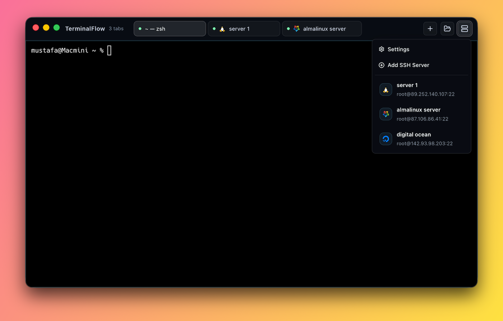
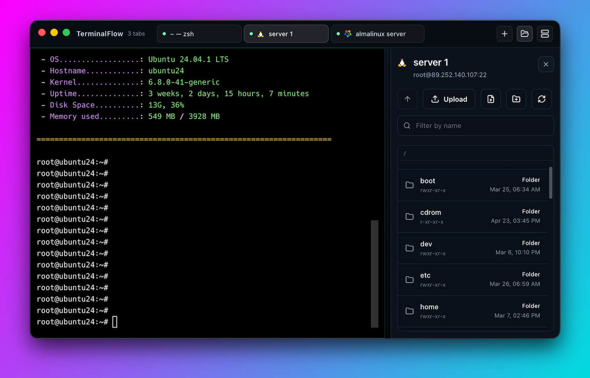

# TerminalFlow

<p align="center">
  
  
</p>

<p align="center">
  <strong>Local terminals, SSH sessions, remote file browsing, and quick editing in one desktop app.</strong>
</p>

TerminalFlow is an Electron-based terminal and SSH workspace built with React and TypeScript. It is designed for developers and operators who want local shells, saved SSH connections, SFTP browsing, and lightweight file editing in a single interface instead of juggling multiple tools.

## ✨ Features

- 🖥️ Local terminal tabs powered by `xterm.js` and `node-pty`
- 🔐 Saved SSH servers with password or private-key authentication
- 🪟 Split the active tab into side-by-side or stacked panes
- 📁 Built-in SFTP browser with upload, download, rename, create, delete, and filtering
- 📝 Open local or remote text files in the built-in editor with syntax highlighting
- ⚡ Quick commands, command palette actions, and tab reordering
- 🎨 Customizable terminal fonts, cursor styles, colors, and startup behavior
- 💾 Previous session restore plus settings import/export
- 🌍 Build targets configured for macOS, Windows, and Linux

## 🚀 Getting Started

### Requirements

- `Node.js` and `npm`
- OpenSSH client tools available in `PATH` (`ssh` and `scp`)
- macOS, Windows, or Linux

### Run in development

```bash
npm install
npm run dev
```

### Create a production build

```bash
npm run build
```

Platform-specific packaging commands:

```bash
npm run build:mac
npm run build:win
npm run build:linux
```

Build artifacts are generated in `dist/`.

### macOS install note

If macOS blocks the app when opening it, clear the app's extended attributes before launching:

```bash
xattr -cr /Applications/TerminalFlow.app
```

## 🧱 Stack

- Electron
- React
- TypeScript
- `xterm.js`
- `ssh2-sftp-client`
- CodeMirror

## 📂 Project Structure

```text
src/main       Electron main process
src/preload    Secure preload bridge
src/renderer   React UI
src/shared     Shared app types and contracts
```

## 🤝 Contributing

Issues and pull requests are welcome. If you plan to make a larger change, open an issue first so the scope and direction are clear before implementation starts.
