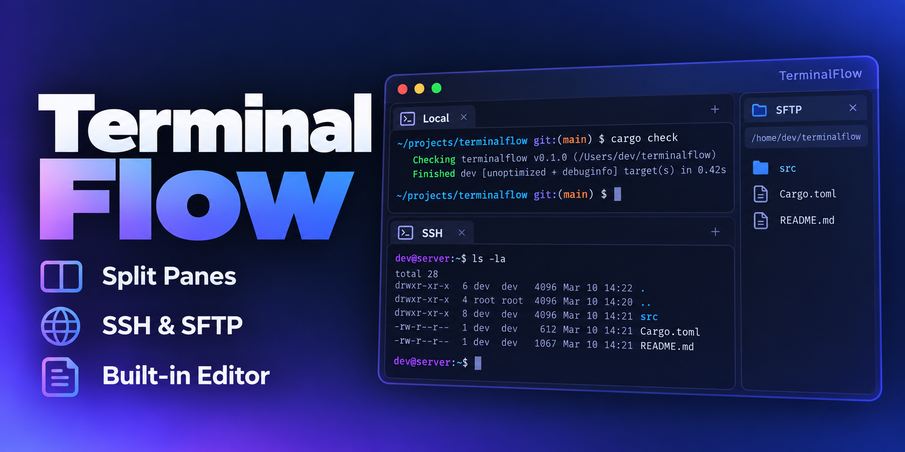
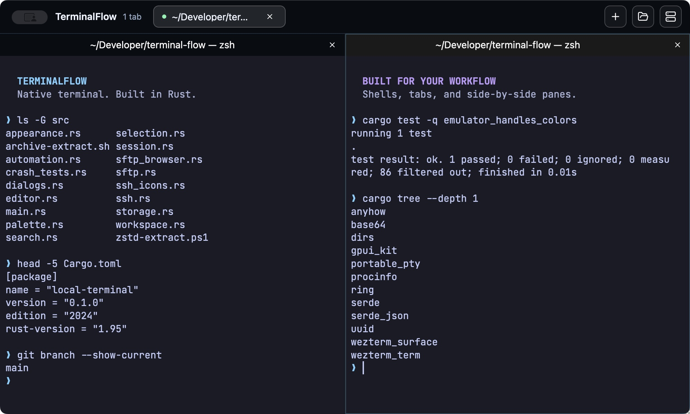
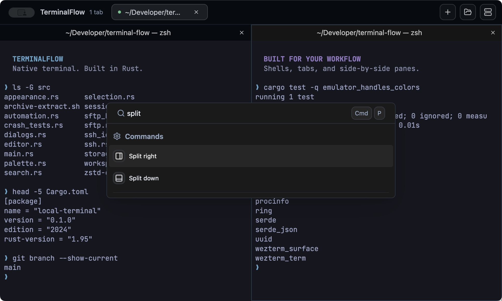

# TerminalFlow

A native terminal workspace for developers working across local projects and remote servers, built in Rust.

TerminalFlow brings shell sessions, SSH connections, SFTP transfers, and a built-in file editor into one desktop app. Developers can run commands, inspect output, move files, and edit local or remote code without switching between separate terminal, file-transfer, and editor windows.



**Split panes · SSH & SFTP · Built-in editor**

## Who it is for

- Developers who build and test locally while deploying or debugging over SSH.
- Engineers and server administrators who need terminal access, remote file management, and quick edits in the same workspace.

## Project status

TerminalFlow is under active development. The repository includes the terminal, SSH/SFTP, editor, and workspace features documented below, with release packaging for macOS Apple Silicon, Linux AMD64, and Windows AMD64.

## Planned Claude assistant

We plan to integrate the Claude API into TerminalFlow so developers can get help directly in their terminal workspace:

- Turn natural-language requests into shell command suggestions.
- Explain selected terminal errors and suggest troubleshooting steps.

The goal is to reduce the time spent looking up commands and interpreting failures during local development and remote server work. This assistant is planned and has not been implemented yet.

## Features

### Terminal and workspace

- Native terminal rendering with WezTerm's emulator and a real PTY for each shell.
- Uses your configured shell (`SHELL`), with a login shell on Unix; falls back to `/bin/sh` or PowerShell on Windows.
- ANSI colors, Unicode text, alternate-screen terminal apps, mouse reporting, and bracketed paste.
- Multiple tabs with directory or server labels and **Connecting**, **Ready**, and **Closed** indicators.
- Drag tabs to reorder them; the tab strip scrolls when tabs overflow.
- Split a tab into up to **four independent panes**, arranged side by side or in rows. New panes inherit the current directory and SSH profile.
- Switch tabs and panes with the keyboard, close individual panes, and restart a stopped shell.
- Reveal the local working directory in the system file manager, or open the SFTP panel for an SSH terminal.
- Scrollback with mouse-wheel, trackpad, and draggable scrollbar support.
- Per-pane zoom, reset to actual size, and a temporary status bar for shell and transfer messages.

### Selection, clipboard, and search

- Drag to select text, double-click for a word or path, triple-click for a line, and Shift-click to extend a selection.
- Hold **Shift** to select text in terminal apps that capture the mouse.
- Copy selected text, copy the visible screen, select all scrollback, paste from the clipboard, and paste with the middle mouse button.
- Selection handles Unicode and wrapped lines across scrollback.
- **⌘-click** on macOS or **Ctrl-click** elsewhere opens HTTP(S) links in your browser and file paths in the built-in editor, including paths in SSH output. Hold the modifier to underline the target and show a hand cursor; ordinary clicks and dragging still select text. Explicit OSC 8 hyperlinks, wrapped links, quoted paths with spaces, and `path:line:column` diagnostics are supported (diagnostics open the file).
- Open selected links or paths with **⌘Enter / Ctrl+Shift+Enter**, or **Open selected link or file** in the command palette. Selected URLs also have an **Open link** context-menu action.
- Case-insensitive literal search across the full terminal history, including wrapped lines, with highlighted results and a match counter.
- Navigate results with **Enter / Shift+Enter** or **⌘G / ⌘⇧G**; close search with **Escape**.
- Clear both the visible terminal and its scrollback.

### Actions on selected text

Select text or a filename in terminal output, then use the context menu or command palette:

- **Edit** a local or remote text file; relative paths resolve against the shell's current directory.
- **Download** a selected remote file to a local destination.
- **Extract archive** in the current shell: ZIP, TAR, compressed TAR (`.tar.gz`, `.tar.bz2`, `.tar.xz`, `.tgz`, `.tbz2`, `.txz`, `.targz`), Zstandard (`.zst`, `.tar.zst`, `.tzst`), and standalone Gzip, Bzip2, or XZ files on Unix. Unix ZIP and Zstandard helpers can install a missing tool through a supported package manager; the Windows Zstandard helper can download an official release binary.
- **Run** a selected `.sh` or extensionless script in a Unix shell, making it executable first.
- **Search with Google** opens the selected text as a query in your browser.

### SSH connections

- Add, edit, connect to, and delete named server profiles; undo a profile deletion.
- Configure the host, port, username, optional starting directory, and a server icon from the bundled collection.
- Password authentication, default or agent keys, or a chosen private-key file with an optional saved passphrase.
- Saved passwords and passphrases use application-key encryption to obscure them in settings. The encryption key is embedded in the app binary.
- Connect from the server manager, workspace menu, or searchable command palette.
- SSH keepalives and automatic reconnect attempts every five seconds while the tab and window are active.
- One automatic recovery attempt for a changed host key during connection startup, with a message in the terminal.

### SFTP file browser and transfers

- Resizable remote file panel with an editable directory path, parent-folder navigation, and refresh.
- Case-insensitive filename filtering, folders listed first, file-type icons, sizes, and modification times.
- Open folders or edit files with **Enter**, a double-click, or the context menu.
- Create files and folders, rename entries, and delete files or folders with confirmation.
- Upload multiple files or folders, and download files or folders recursively.
- Drag local files or folders into the SFTP panel to upload them. Dropping them into an SSH terminal uploads to the remote shell's reported working directory.
- Dropping files into a local terminal inserts shell-quoted paths.
- Transfer progress with a percentage, current-file status, and cancellation controls.
- Remote folder deletion is recursive; symbolic links are removed without deleting their targets.

### Built-in file editor

- Open a local file with **⌘O**, edit a selected terminal path, or open a remote file from SFTP.
- Syntax highlighting selected from the filename for supported programming, configuration, shell, and markup languages.
- File metadata showing byte count, line count, language, line endings, and saved or unsaved state.
- Save with **⌘S**, preserving the detected LF, CRLF, or CR line endings and local file permissions.
- Detect changes made to the original file after opening it before saving over it.
- Save through atomic file replacement; remote saving requires the server's SFTP `posix-rename` extension.
- Unsaved-change prompts when closing the editor or quitting the app.
- UTF-8 text files up to **100 MiB locally** or **16 MiB remotely**; binary files and symbolic links are rejected.

### Command palette and quick commands

- **⌘P** opens a keyboard-driven palette with fuzzy, case-insensitive matching.
- Search workspace actions, saved quick commands, and SSH servers; server searches also match usernames, hosts, and ports.
- Add, edit, and delete named quick commands in **Settings → Quick Commands**, including multiline commands.
- Run a quick command in the active local or SSH pane.
- Put a **`$` marker** in a quick command to insert it without executing it and position the cursor at the marker. For example, `git commit -m '$'` leaves the cursor between the quotes. Multiline insertion requires a shell with bracketed paste enabled.

### Appearance and settings

- **12 color schemes:** Midnight Blue, Rose Pine, Dracula, Solarized Dark, Nord, Gruvbox Dark, Tokyo Night, Tomorrow Night, Catppuccin Mocha, One Dark, One Light, and Monokai.
- **10 font choices:** JetBrains Mono, Fira Code, Cascadia Code, Hack, Source Code Pro, Inconsolata, IBM Plex Mono, Ubuntu Mono, DejaVu Sans Mono, and Menlo. All except Menlo are bundled.
- Set font size (**10–32 px**), weight (**300–700** in steps of 100), and line height (**1.0–2.0**).
- Bar, block, or underline cursor; configurable blinking and bar width (**1–6 px**).
- Use palette defaults or custom cursor and selection colors, including transparency.
- Live appearance previews, a reset-to-defaults action, and saved changes applied to every open pane.
- Set the starting directory for new tabs and toggle session restoration.
- Import or export settings as JSON, including appearance, SSH profiles, and quick commands. Importing immediately replaces the current settings.
- Open the app data folder from Settings.

### Session restoration

- Automatically save tab order, the active tab, working directories, zoom, scroll positions, SFTP panel width, and window position, size, and maximized state.
- Restore up to **500 completed lines of local output per tab** and start a fresh shell in the saved directory.
- Restore SSH profile and directory information and reconnect when the tab becomes active.
- Each tab saves its active pane; split layouts and running processes are not restored. SSH output is not saved.
- A `--preview` workspace starts fresh with separate temporary app data and no personal SSH profiles or quick commands.

### macOS integration

- **TerminalFlow → Check for Updates…** checks GitHub for a newer release, downloads and verifies it, replaces the installed Apple Silicon app, and offers to restart. The app must be in a writable Applications folder; unsaved editor changes are protected before restarting.
- Install a native app bundle and a **TerminalFlow Finder** helper with the installation script below.
- The Finder helper opens a new terminal at the front Finder window's folder, or the Desktop when no Finder window is open.
- The **`terminalflow://` URL scheme** can activate the app or open a new local tab with an optional working directory, custom title, and startup command.

```sh
open 'terminalflow://activate'
open 'terminalflow://new-terminal?cwd=%2Ftmp&title=Scratch&command=pwd'
```

URL parameters are `cwd`, `title`, and `command`. Percent-encode parameter values; `cwd` must be an existing absolute directory. URL commands run in the newly opened shell.

## Workspace



*A real TerminalFlow workspace: side-by-side shells, JetBrains Mono, and the Tokyo Night color scheme.*

## Command palette

Press **⌘P** to find workspace actions without leaving the keyboard.



## Install with Homebrew

On an **Apple Silicon Mac running macOS 11 or newer**:

```sh
brew tap mzgs/terminal-flow https://github.com/mzgs/terminal-flow
brew install terminalflow
```

To update:

```sh
brew upgrade terminalflow
```

For Homebrew installations, use these commands for updates so Homebrew's
installation record stays in sync. The Finder helper remains a separate download
from [GitHub releases](https://github.com/mzgs/terminal-flow/releases/latest).
Release builds are ad-hoc signed and not notarized; if macOS blocks the first
launch, allow TerminalFlow in **System Settings → Privacy & Security**.

This repository also serves as the [Homebrew tap](https://docs.brew.sh/How-to-Create-and-Maintain-a-Tap).
After publishing a release, the workflow commits the new cask version and SHA-256
checksum to the default branch using its `contents: write` permission. Branch
rules must allow the release workflow to push that cask update.

## Run locally

Requires Rust **1.95 or newer** and Cargo. From the repository root:

```sh
./run.sh
```

For a fresh preview workspace:

```sh
./run.sh --preview
```

On macOS, build and install the app into `/Applications`:

```sh
./scripts/install-macos-app.sh
```

## GitHub releases

Commit and push the release workflow and your changes first, then run (requires `curl` and `jq`):

```sh
./scripts/release.sh --dry-run
./scripts/release.sh
```

The script reads the GitHub token from the HTTPS `origin` URL in `.git/config`,
selects the next unused `vX.Y.Z` version (starting with `Cargo.toml`), and starts
[GitHub Actions](https://docs.github.com/en/rest/actions/workflows#create-a-workflow-dispatch-event).
The token needs access to the repository and permission to run Actions.
The workflow must be on the repository's default branch before its first run.

Once all native builds pass, the workflow publishes macOS ARM64 app ZIPs,
a Linux AMD64 tarball, a Windows AMD64 ZIP, checksums, and generated release notes.
It then updates `Casks/terminalflow.rb` so Homebrew users can upgrade to the release.
Linux binaries are built on Ubuntu 22.04 and require the system's Fontconfig,
Wayland, XKB/XCB libraries, and a Vulkan-capable graphics driver.
Local macOS installs create and reuse a self-signed certificate in your login
Keychain, with no Apple Developer account required. Automatic updates preserve
that local identity, so macOS file permissions survive rebuilds and updates.
macOS may ask once when switching from an ad-hoc install to this identity.
CI release ZIPs use ad-hoc signing; Apple notarization is not configured.

## Keyboard shortcuts

| Action | macOS shortcut |
| --- | --- |
| New tab | ⌘T |
| Next / previous tab | ⌃Tab / ⌃⇧Tab, or ⌘⇧] / ⌘⇧[ |
| Split right | ⌘D |
| Split down | ⌘⇧D |
| Next / previous pane | ⌘⌥→ / ⌘⌥← |
| Close pane | ⌘⇧W |
| Close tab | ⌘W |
| Command palette | ⌘P |
| Find in terminal | ⌘F |
| Next / previous search result | ⌘G / ⌘⇧G |
| Copy selection | ⌘C or ⌘⇧C |
| Open selected link or file | ⌘Enter |
| Copy visible screen | ⌘⌥C |
| Paste | ⌘V |
| Select all scrollback | ⌘A |
| Clear terminal and scrollback | ⌘K |
| Restart stopped shell / reconnect disconnected SSH | ⌘R |
| Show status bar | ⌘⇧B |
| Settings | ⌘, |
| Manage SSH servers | ⌘⇧S |
| Open local file | ⌘O |
| Save in file editor | ⌘S |
| Zoom in / out / reset | ⌘+ / ⌘− / ⌘0 |
| Quit | ⌘Q |

Additional Ctrl bindings are available: **Ctrl+P** for the palette, **Ctrl+T** for a new tab, **Ctrl+Shift+D / Ctrl+Alt+D** for splits, **Ctrl+Alt+←/→** for panes, **Ctrl+W** to close a tab, **Ctrl+Shift+W** to close a pane, **Ctrl+Shift+F** for search, **Ctrl+Shift+C/V/A** for copy/paste/select all, **Ctrl+Shift+K** to clear, **Ctrl+Shift+B** for status, **Ctrl+Shift+S** for servers, **Ctrl+,** for settings, and **Ctrl+Shift+=/−/0** for zoom. **Ctrl+Insert / Shift+Insert** also copy and paste. On non-macOS platforms, **Ctrl+F**, **Ctrl+O**, and **Ctrl+S** are also bound to search, open, and editor save.

## Claude for Startups application

For the [Claude for Startups program](https://claude.com/programs/startups), this short description summarizes the current product and intended Claude usage:

> TerminalFlow is a native terminal workspace built in Rust for developers working across local projects and remote servers. It combines shell sessions, SSH, SFTP transfers, and a built-in file editor. We plan to integrate the Claude API to suggest shell commands from natural-language requests and explain terminal errors, helping developers troubleshoot within the same workspace. The Claude assistant is not yet implemented.

Before [applying through Claude Console](https://platform.claude.com/offers/startups-application), prepare:

- A Claude Console account.
- A company website and a company email address matching its domain.
- Your founding or funding date: the program currently accepts startups founded within the last five years or funded within the last two years, including bootstrapped startups.
- A short description of the product and an accurate account of how you use or intend to use Claude.

Check the linked program page for current requirements. Company details and eligibility must be supplied by the founder.

Built with [GPUI Kit](https://github.com/longbridge/gpui-kit), [WezTerm's `wezterm-term`](https://github.com/wezterm/wezterm/tree/main/term) emulator, and its `portable-pty` library.
